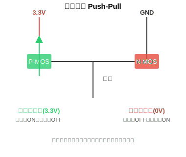
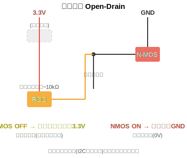
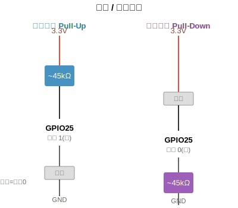

# 第18章 GPIO 点亮 LED——嵌入式版的 Hello World

> **难度**：⭐⭐⭐  
> **所属教程**：Python 零基础入门到 MicroPython 嵌入式实战  
> **前置章节**：第17章（MicroPython 固件烧录 & Thonny 连接）

---

### 18.1 什么是 GPIO

GPIO（General Purpose Input/Output）即**通用输入输出引脚**。你可以通过代码控制这些引脚输出高电平（3.3V）或低电平（0V）。

### 18.2 认识 LED——发光二极管

**LED** 全称 **发光二极管**（Light Emitting Diode）。它和普通灯泡不同——是一种**半导体器件**，电流只能**单向导通**：

```
正向导通（正常点亮）         反向截止（不亮）
  ──▶|──                      ──|◀──
  电流从正极→负极              电流反向，不通
```

LED 有正负极之分：
- **长脚**是正极（Anode），接高电平（3.3V）
- **短脚**是负极（Cathode），接 GND

**二极管的核心特性——正向压降**

二极管的"单向导通"不是免费的：电流通过它的时候，它会**吃掉一部分电压**，这叫**正向压降**（Forward Voltage Drop）。就像一个关卡，进门先扣掉一部分电压。

常见 LED 的正向压降约 **2V**（红色约 1.8~2.0V，蓝色/白色约 3.0~3.2V）。

这意味着：ESP32 输出 3.3V → 经过 LED 被吃掉 2V → 只剩 1.3V 了。这 1.3V 必须落在别的地方（电阻），否则电流会失控。

**LED 的亮度由电流决定——不需要很大**

很多人误以为 LED 越亮越好。实际上，作为指示灯，**2mA 左右就有不错的亮度**了。电流过大有缺点：
- 刺眼（尤其做指示灯的话）
- 减少 LED 寿命
- 超出 GPIO 引脚的安全范围

所以计算时，我们以 **2mA（0.002A）** 为目标电流，**最大不超过 5mA**。

### 18.3 硬件连接

```
                 限流电阻 1kΩ
ESP32 GPIO13 ────/\/\/\/\/──┬── LED 正极（长脚）
                             │
                          LED 负极（短脚）
                             │
                            GND
```

> **关键**：LED 长脚接正极（通过电阻接 GPIO），短脚接 GND。电阻必须串接在电路里。

### 18.4 电阻怎么选？——用欧姆定律算一遍

**已知条件：**
- ESP32 GPIO 输出：3.3V
- LED 正向压降：~2V
- 目标电流：2mA = 0.002A（指示灯亮度刚好）

**剩下的电压落在电阻上：**

```
U电阻 = 3.3V - 2V = 1.3V
```

**欧姆定律**：`R = U ÷ I`

```
R = 1.3V ÷ 0.002A = 650Ω
```

计算结果是 650Ω。实际选用 **1kΩ（1000Ω）**，原因是：

1. 1kΩ 是标准电阻值，容易买到
2. 比 650Ω 稍大 → 实际电流 = 1.3V ÷ 1000Ω = **1.3mA**，亮度足够又更加安全
3. 多几个公式都不会烧——电阻用大了只不过 LED 暗一点，用小了可能烧坏

**不接电阻会怎样？**

没有电阻时，GPIO 输出端 → LED（吃掉 2V）→ 直连 GND。剩下 1.3V 落在导线上，导线电阻 ≈ 0Ω：

```
I = 1.3V ÷ 0Ω → 电流瞬间飙升
```

LED 或 GPIO 引脚会烧掉。**限流电阻不是'可选'，是必须有的保护。**

### 18.5 ESP32 引脚电流限制

即使有电阻保护，也要知道 ESP32 GPIO 引脚的能力上限：

- **单个引脚最大**：约 12mA（默认），可软件配置到 40mA
- **安全建议**：长期工作控制在 ≤5mA 每引脚
- **所有引脚总电流**：受板载 3.3V 稳压器限制

> 我们 1kΩ 电阻 + LED 的电流只有 1.3mA，远离上限，放心使用。

### 18.6 machine 库——操控 ESP32 硬件的钥匙

从本章开始，你需要接触 MicroPython 最核心的库：**`machine`**。它是 ESP32 硬件操作的总入口——GPIO、PWM、I2C、ADC 等所有底层功能，都通过它来调用。

本节只用到了它里面的一个类：**`Pin`**（引脚），用来控制 GPIO 引脚的输入输出。

```python
from machine import Pin    # 从 machine 库导入 Pin 类
```

第10章学过 `import`——这里 `from machine import Pin` 的意思是：只从 `machine` 这个模块里拿 `Pin` 这一个类，其他功能不导入。

**`Pin` 的用法：**

```python
led = Pin(13, Pin.OUT)     # 将 GPIO13 设为输出模式（OUT = Output）
button = Pin(25, Pin.IN)   # 将 GPIO25 设为输入模式（IN = Input）
```

`Pin(引脚编号, 模式)` 创建了一个引脚对象。模式有三种：
- `Pin.OUT`：输出模式
- `Pin.IN`：输入模式
- `Pin.PULL_UP`：输入 + 内部上拉电阻（第20章详讲）

#### 输出模式：推挽 vs 开漏

输出模式只是告诉你"这个引脚在输出信号"，但**怎么输出**还有两种不同的方式：

**推挽输出（Push-Pull）——默认方式，最常用**

推挽输出相当于引脚内部有两个开关：一个接 3.3V，一个接 GND，两者互斥工作。



"推挽"的名字很形象：高电平时**推**出电流，低电平时**挽**入电流。两个开关互斥——永远不会同时接通，所以不会短路。ESP32 的 GPIO 默认就是推挽输出。

> 你写的 `Pin(13, Pin.OUT)` 就是推挽模式，驱动 LED、控制继电器都靠它。

**开漏输出（Open-Drain）——需要外接上拉电阻**

开漏输出只有下面那个接 GND 的开关，没有上面的 3.3V 开关。



开漏模式的引脚**自己不会输出高电平**——它能"拉低"（接地），但"拉高"需要**外接一个上拉电阻到 3.3V**。

为什么需要开漏？因为多路开漏引脚可以共享同一根线——任何一路拉低，整根线就是低电平，这就实现了"线与"逻辑。I2C 总线就是靠开漏实现的（第21章会见到）。

**对比：**

| 特性 | 推挽 Push-Pull | 开漏 Open-Drain |
|------|---------------|----------------|
| 高电平来源 | 内部直接输出 3.3V | 需要外部上拉电阻 |
| 驱动能力 | 强（推和挽都能提供电流） | 弱（高电平靠电阻） |
| 能否多路共线 | ❌ 不能（会短路） | ✅ 可以（线与逻辑） |
| 典型用途 | 驱动 LED、控制继电器 | I2C 总线、电平转换 |
| MicroPython | `Pin.OUT`（默认） | `Pin.OPEN_DRAIN` |

#### 上下拉电阻——解决"悬空"问题

当引脚设为输入模式（`Pin.IN`）时，如果什么都没接，引脚处于**悬空**状态——电压不确定，读到的结果随机漂移。

**上拉电阻**（Pull-Up）：电阻接到 3.3V，默认高电平，按键按下时拉到 GND 变成低电平。

**下拉电阻**（Pull-Down）：电阻接到 GND，默认低电平，按键按下时拉到 3.3V 变成高电平。



ESP32 内置了上拉和下拉电阻（约 45kΩ），不需要外接：

```python
button = Pin(25, Pin.IN, Pin.PULL_UP)    # 输入 + 内部上拉
button = Pin(25, Pin.IN, Pin.PULL_DOWN)  # 输入 + 内部下拉（某些引脚不支持）
```

> 第20章按键用的是 `PULL_UP`——默认读到 1，按下读到 0。这样一行代码就省去了外部电阻。

创建好 `led` 这个 Pin 对象后，用 `.value()` 来控制电平：

```python
led.value(1)     # 输出高电平（3.3V）→ LED 亮
led.value(0)     # 输出低电平（0V）→ LED 灭
```

`time.sleep()` 来自另一个内置模块 `time`，作用是让程序暂停指定秒数：

```python
import time
time.sleep(0.5)  # 暂停 0.5 秒
```

> `machine` 库是 MicroPython 独有的，在电脑版 Python 里没有。你在 Thonny 选择 MicroPython (ESP32) 解释器后，它才能正常导入。这就是为什么第16~17章先要烧录固件并连接 ESP32。

### 18.7 代码——点亮 LED

```python
from machine import Pin
import time

# GPIO13 设为输出模式
led = Pin(13, Pin.OUT)

# 点亮 LED
led.value(1)     # 1 = 高电平 = 亮
time.sleep(2)    # 保持 2 秒
led.value(0)     # 0 = 低电平 = 灭
```

### 18.8 LED 闪烁

```python
from machine import Pin
import time

led = Pin(13, Pin.OUT)

while True:
    led.value(1)     # 亮
    time.sleep(0.5)  # 等 0.5 秒
    led.value(0)     # 灭
    time.sleep(0.5)  # 等 0.5 秒
```

你会看到 LED 以每秒一次的频率闪烁。恭喜，你写的代码已经能影响物理世界了！

### 18.9 小实验——能不能让 LED "半亮"？

你现在的代码只能让 LED **全亮**或**全灭**。试着想一个问题：

**有没有办法让 LED 看起来像是"50% 亮度"？**

直觉上你会想：能不能让 GPIO 输出 1.65V？——不行，GPIO 只能输出两种状态：3.3V（`value(1)`）或 0V（`value(0)`），没有中间值。

试试这段代码，看看效果：

```python
from machine import Pin
import time

led = Pin(13, Pin.OUT)

while True:
    led.value(1)
    time.sleep(0.001)   # 亮 1 毫秒
    led.value(0)
    time.sleep(0.009)   # 灭 9 毫秒
```

你觉得 LED 会比之前**暗**还是**亮**？先猜，再实际跑一下。

把 `sleep` 的时间反过来试一下：

```python
while True:
    led.value(1)
    time.sleep(0.009)   # 亮 9 毫秒
    led.value(0)
    time.sleep(0.001)   # 灭 1 毫秒
```

现在的亮度呢？

---

**你发现规律了吗？**

LED 并没有真的"变暗"——它一直在**疯狂闪烁**，只是闪得太快，你的眼睛来不及分辨。

这里引入两个概念：

**总周期** = 亮的时间 + 灭的时间（完成一次"亮→灭"的完整循环）

上面两段代码的总周期都是 1ms + 9ms = **10ms**。

**频率** = 1 ÷ 总周期 = 每秒闪烁多少次

1 ÷ 0.01s = **100Hz**（每秒闪烁 100 次）。这已经快过人眼能分辨的 ~50Hz 阈值，所以你看到的不是闪烁，而是"持续发光但比较暗"。

眼睛看到的亮度，取决于**亮的时间占一个周期的比例**（占空比）：

| 亮 | 灭 | 总周期 | 频率 | 占空比 | 眼睛看到的 |
|----|----|--------|------|--------|----------|
| 1ms | 9ms | 10ms | 100Hz | 10% | 很暗 |
| 5ms | 5ms | 10ms | 100Hz | 50% | 半亮 |
| 9ms | 1ms | 10ms | 100Hz | 90% | 很亮 |

**这和家里的灯泡是一样的原理**：中国的交流电是 220V / **50Hz**，白炽灯其实每秒亮灭 100 次（正负半周各亮一次）。因为频率够高，你的眼睛来不及反应，只觉得"一直亮着"。如果频率降到很低——比如 10Hz——你就会看到明显的闪烁了。

> 频率越高，亮度调节越细腻，眼睛越不容易察觉到闪烁。下一章 ESP32 硬件 PWM 默认频率高达 5000Hz，比这里的 100Hz 快 50 倍。

这种"用快速开关来模拟不同亮度"的技术，就是下一章要讲的 **PWM**（脉冲宽度调制）。它的核心思想非常朴素：**用时间换亮度**——你不需要一个"半电压"，你只需要快速切换全亮和全灭，调整亮灭的时间比例即可。

> 你现在用 `sleep()` 手动实现的 PWM，下一章将用 ESP32 硬件的 PWM 模块来做——它不需要 `while True` 循环，不需要 `sleep`，你设一个占空比，硬件自己在后台帮你闪，又快又省 CPU。你现在对新概念有了直觉，下一章会学得更轻松。

---

### 练习任务

**任务（⭐ 容易）**：连接一个 LED（GPIO13），让它以 0.3 秒间隔快速闪烁 10 次，然后长亮 3 秒再熄灭。

> 提示：用 `for i in range(10)` 循环 + `time.sleep(0.3)`。

**任务（⭐⭐ 中等）**：接上 3 个 LED（分别接 GPIO13、GPIO12、GPIO14），实现**流水灯**效果：LED1 亮 → 灭 → LED2 亮 → 灭 → LED3 亮 → 灭 → 循环往复。

```
电路参考：
GPIO13 ──[1kΩ]── LED1 ── GND
GPIO12 ──[1kΩ]── LED2 ── GND
GPIO14 ──[1kΩ]── LED3 ── GND
```

> 提示：定义列表 `leds = [led1, led2, led3]`，用 for 循环控制。

**任务（⭐⭐⭐ 困难）**：用 3 个 LED 实现**倒计时灯**：

1. 开始时 3 个 LED 全亮
2. 每秒熄灭一个：3→2→1→0
3. 全灭后等 1 秒，然后 3 个 LED 同时快闪 3 次（模拟"发射"）
4. 最后全部长亮

> 综合运用：GPIO 输出（第18章）+ for 循环（第9章）+ 列表（第8章）+ `time.sleep()` 时间控制。

---

💡 **思考延续**

你刚点亮的这粒小小的 LED，是 1962 年由 **Nick Holonyak Jr.** 在通用电气实验室发明的——那是世界上第一颗可见光 LED。当时它只能发出微弱的红光，每颗要卖 200 美元。

经过 60 多年，LED 的亮度提升了上千倍，价格从几百美元降到了几分钱。当年 Holonyak 说："有一天 LED 会取代爱迪生的白炽灯泡。"当时没人信。而此时此刻，你正在用代码控制这束来自 1962 年的红光。
